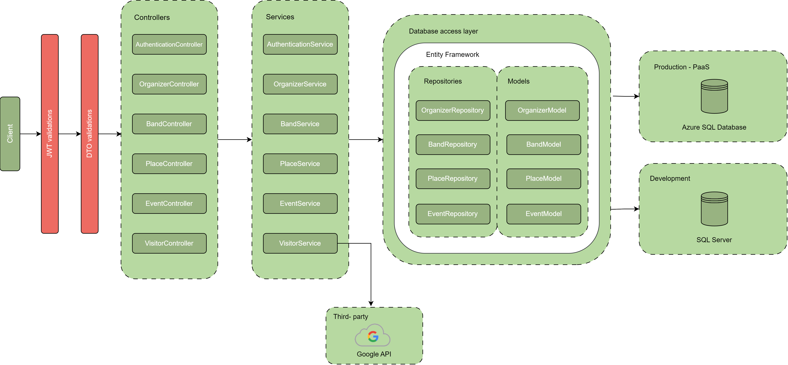
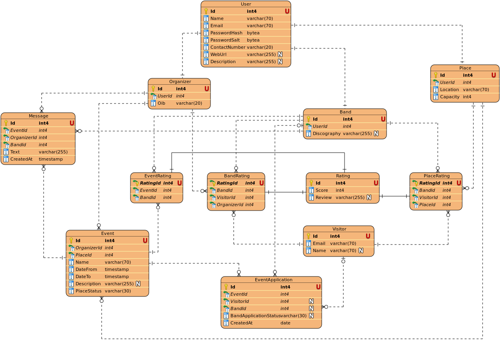

# Table of Contents

- [Introduction](#introduction)
- [Functionalities](#functionalities)
  - [Role Functionalities](#role-functionalities)
  - [Project Specification](#project-specification)
    - [Project Architecture](#project-architecture)
      - [Client Side](#client-side)
      - [Server Side](#server-side)
        - [Controllers](#controllers)
        - [Services](#services)
        - [Database Access Layer](#database-access-layer)
        - [Repositories](#repositories)
        - [Models](#models)
        - [Databases](#databases)
        - [Third-party](#third-party)
    - [Entity-Relationship Diagram](#entity-relationship-diagram)
- [Running the MS SQL Server](#running-the-ms-sql-server)
  - [Required tools](#required-tools)
  - [Running the defined networks, services, and volumes](#running-the-defined-networks-services-and-volumes)
  - [Closing the defined networks, services, and volumes](#closing-the-defined-networks-services-and-volumes)
- [Collaborators](#collaborators)

# Introduction

This repository serves as the foundation for the API developed during the JCC (Java Coding Challenge) program in collaboration with Span and Ekobit companies. As part of the Software Analysis and Design course, participants engaged in both theoretical learning and practical application. Throughout the course, attendees had the opportunity to deepen their understanding of software design principles while concurrently developing an API tailored for a concert application. This comprehensive approach provided invaluable insights into real-world software development practices and fostered a rich learning environment for all participants.

# Functionalities

| **Role**           | **Functionality**                                     | **Description**                                                                                 |
|--------------------|-------------------------------------------------------|-------------------------------------------------------------------------------------------------|
| Organizer          | Organizer/venue profile                               | Organizers and venues can create their profiles with basic information, contacts, and event histories. |
|                    | Description of venue, event, and concert times        | Organizers provide detailed descriptions of the concert venue, event information, and event dates. |
|                    | Selection of registered groups                        | Organizers review and select groups/musicians that have applied to perform at the concert.   |
|                    | Group evaluation                                      | Organizers have the ability to rate and evaluate the registered groups to choose the best ones. |
| Group/Musician     | Group/musician profile                                | Groups and musicians can create their profiles with biographical information and details about their work (albums, singles, concerts, etc.). |
|                    | Finding events and applying                           | Groups can browse available concerts and apply to perform.                                      |
|                    | Event application                                     | Groups submit their performance applications for specific concerts.                              |
|                    | Chat/"wall" for communication (shared with all groups and organizers) | Groups can communicate with other performers and organizers via a shared chat wall to coordinate performance details. |
|                    | Venue evaluation                                      | Groups can rate the venue after their performance to provide feedback.                           |
| Visitor            | Google login                                          | Visitors can sign in with their Google accounts to participate in rating groups and venues. |
|                    | Rating groups and venues                              | Visitors can rate performers and concert venues after the concert and share their impressions and reviews. |

# Project Specification

## Project Architecture



### Client Side
- Represents the user interface or the device that the end-user interacts with. 
- JWT Validations - Indicates that JSON Web Tokens (JWT) are used for authentication purposes.
- DTO Validations - Denotes the validation process for Data Transfer Objects (DTO).

### Server Side
#### Controllers
This layer contains multiple controllers which are essentially responsible for handling incoming requests, processing them, and sending back the appropriate responses. The controllers listed are:
- AuthenticationController
- OrganizerController
- BandController
- PlaceController
- EventController
- VisitorController  

#### Services
These are intermediate layers between the controllers and the database access layers. They typically contain business logic and call repositories for database operations. The services listed are:
- AuthenticationService
- OrganizerService
- BandService
- PlaceService
- EventService
- VisitorService  

#### Database Access Layer
This project uses Entity Framework ORM, it allows us to work with databases using .NET objects without having to focus on database-specific details.  

#### Repositories  
These components handle the actual database operations. They abstract the details of accessing data and provide a more object-oriented view. The repositories listed are:
- OrganizerRepository
- BandRepository
- PlaceRepository
- EventRepository  

#### Models  
These are the actual data structures or objects that the database tables represent. The models listed are:
- OrganizerModel
- BandModel
- PlaceModel
- EventModel

#### Databases  

- Production (Pass) - This depicts the Production environment database, which is on the Azure SQL
- Development - Represents the Development environment database, which is on SQL Server, a relational- database management system.  

#### Third-party
Google API: Indicates that this architecture integrates with a Google API for some functionality, specifically OnConcert API uses Google API to successfully authenticate users via his Google credentials. The arrows on the diagram shows the direction of data flow and interactions among the different components. The architecture follows a clear separation of concerns, making it scalable and maintainable.

## Entity-Relationship Diagram



*This ERA Model is designed to represent the data structure and relationships within a digital platform dedicated to organizing concerts. This model serves to streamline the concert planning, registration, evaluation, and participation processes, ensuring successful concert events.*

# Running the MS SQL Server

### Required tools

* [Docker Engine](https://docs.docker.com/get-docker/) (`v. 24`)
* [Docker Compose](https://docs.docker.com/get-docker/) (`v. 2`)

Or you can download [Docker Desktop](https://docs.docker.com/desktop/), which includes both the Docker Engine and Compose tool.

### Running the defined networks, services, and volumes

From the root directory, run the following command:
```bash
docker-compose up [--detach]
```

### Closing the defined networks, services, and volumes

From the root directory, run the following command:
```bash
docker-compose down [--detach]
```

# Collaborators

This project was developed by a collaborative team following the `Scrum` methodology, ensuring iterative development and close collaboration between team members. For a comprehensive view of the project progress and tasks, please visit our [Azure DevOps page](https://dev.azure.com/NoAiR/OnConcert-api/_workitems/recentlyupdated/).
